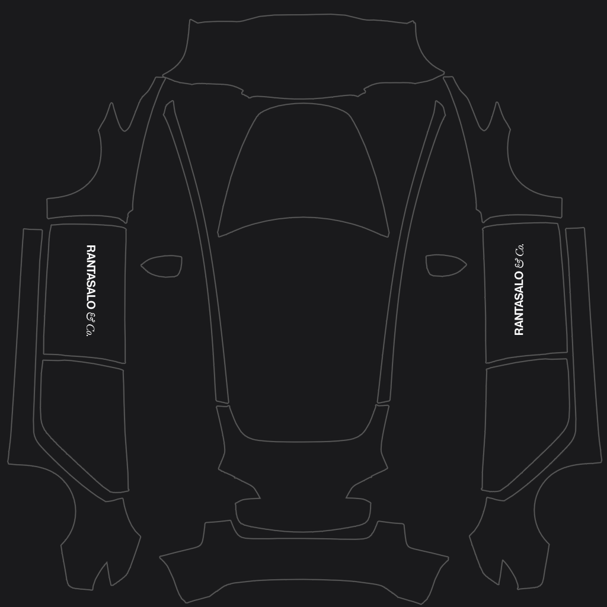
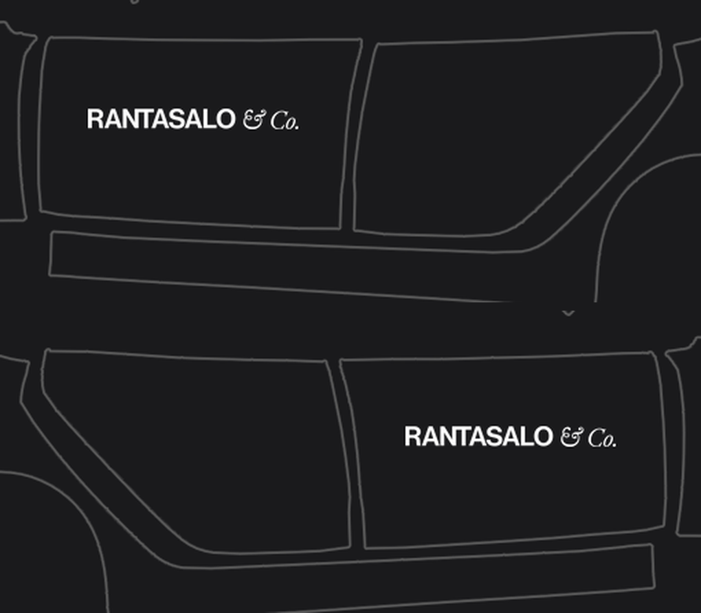

# Rantasalo & Co. — Model 3 Wraps

Gloss black (`#1A1A1C`) over every panel, with the RANTASALO & Co. wordmark in white.
Two versions — pick one, or load both and switch between them in the car.

| | |
| --- | --- |
| [`Rantasalo_Black.png`](Rantasalo_Black.png) | wordmark on the hood |
| [`Rantasalo_Sides.png`](Rantasalo_Sides.png) | wordmark on the left and right front doors, hood left clean |

Built for a **2021 Model 3**, which uses the pre-refresh [`model3` template](../template.png).
2024+ cars use a different UV layout — see [`model3-2024-base`](../../model3-2024-base/)
or [`model3-2024-performance`](../../model3-2024-performance/).

## Install

* **Mobile app** (v4.59.0 or later): Creations → Wrap → Upload
* **USB drive**: put the PNGs in a folder called `Wraps` at the root of an exFAT/FAT32 drive

Then apply in the car: Toybox → Paint Shop → Wraps tab.

## Preview

<table>
<tr>
<td align="center" valign="top">
<a href="preview.png"></a><br/>
Hood version
</td>
<td align="center" valign="top">
<a href="preview_sides.png"></a><br/>
Sides version
</td>
</tr>
<tr>
<td align="center" valign="top">
<a href="preview_hood.png"></a><br/>
The hood, seen from in front of the car
</td>
<td align="center" valign="top">
<a href="preview_doors.png"></a><br/>
Left side above, right side below, each as you see it standing beside the car
</td>
</tr>
</table>

## Design notes

* **Canvas** — 1024×1024 RGB PNG, under 16 KB. The body colour fills the whole
  canvas rather than just the panel outlines, so texture filtering can't pull a
  white fringe in along any panel edge.
* **Body colour** — `#1A1A1C`, not `#000000`. At zero the diffuse term is dead and
  the car renders as a flat silhouette, losing all of its bodyline shape. `#1A1A1C`
  is about 1% linear reflectance, which is where real jet black basecoat sits, and
  the blue channel is lifted by two because automotive blacks read slightly cool
  rather than dead neutral. Tesla's own examples put black between 18 and 35, and
  their `Camo_Stealth` uses the same faint cool cast.
* **Size** — the wordmark is 153 px long in both versions, which works out to
  roughly 80 cm on the car either way: the hood island and the door islands come
  out at about the same pixels-per-millimetre. That is 53% of the hood's 288 px
  width, leaving 40 px clear on each side, and 69% of the door's 223 px length,
  leaving 35 px clear fore and aft.
* **Hood placement** — centred on the island's centre line at row 293, just behind
  the hood's centroid at row 289. The first ~55 rows of the island are the steeply
  curved nose, where a top-down unwrap stretches artwork; keeping the mark behind
  that puts it on the flat of the hood.
* **Door placement** — 55% of the way up the door's full-height band, so it sits
  just above centre the way vehicle lettering usually does, and centred along the
  length of the door.
* **Orientation** — the nose of the car is the *top* of the hood island, so the
  hood mark is rotated 180° in the texture; that is what makes it read the right
  way up for someone standing in front of the car, which is also the angle the
  Paint Shop previews from. The sides are laid out with the front of the car at the
  top and the roof towards the middle of the texture, so the two doors take
  opposite quarter turns. Relative to the car the text therefore runs front-to-back
  on the left and back-to-front on the right — that is correct, and is what makes
  it read left to right from either side.
* **Colour inversion** — the source logo is near-black (`#0A0A0A`) artwork. It is
  inverted by taking the rendered coverage as an alpha mask and painting it white,
  which keeps the antialiased edges clean instead of hard-thresholding them.

## Rebuilding

[`build_wrap.py`](build_wrap.py) regenerates every image in this folder from
[`rantasaloco_logo.pdf`](rantasaloco_logo.pdf) and the Model 3 template.

```sh
pip install pillow numpy pymupdf
python3 build_wrap.py
```

The constants at the top control the design: `BACKGROUND` is the body colour,
`LOGO_LENGTH` the size of the wordmark, `HOOD_CENTER_Y` how far back it sits on the
hood, and `SIDE_HEIGHT_FRAC` how high it sits on the doors. The script finds the
hood and door panels from the template itself, and fails rather than writing a file
if the mark would spill off the panel it is meant to be on.

## Files

| File | What it is |
| --- | --- |
| `Rantasalo_Black.png` | The wrap with the wordmark on the hood. Upload this to the car. |
| `Rantasalo_Sides.png` | The wrap with the wordmark on both front doors. Upload this to the car. |
| `Rantasalo_Logo_White.png` | The wordmark inverted to white on transparency, 9732×968, for reuse elsewhere. |
| `preview.png`, `preview_sides.png` | Each design with the template's panel outlines drawn over it. |
| `preview_hood.png`, `preview_doors.png` | Detail shots, rotated to the orientation you see them in on the car. |
| `build_wrap.py` | Build script. |
| `rantasaloco_logo.pdf` | Source logo. |

---

[← Model 3 templates and examples](../)
