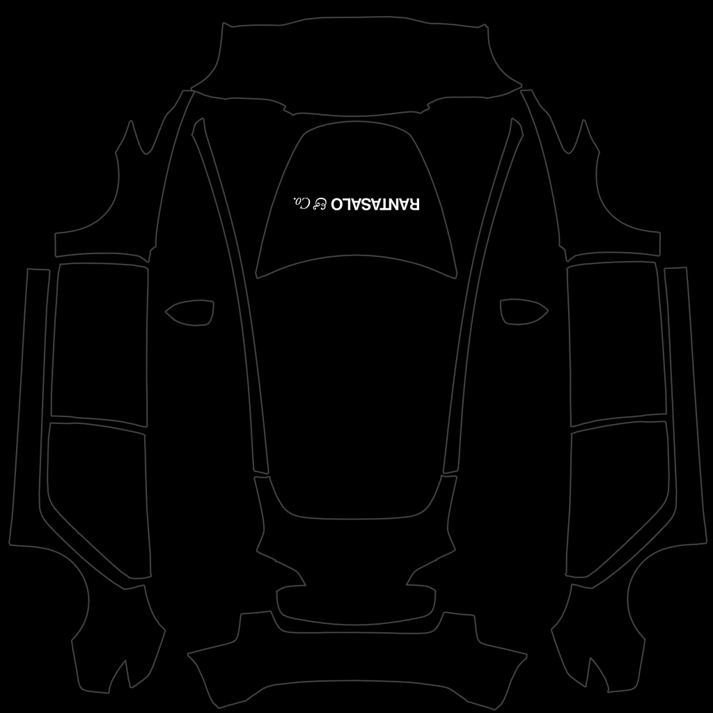

# Rantasalo & Co. — Model 3 Wrap

Gloss black over every panel, with the RANTASALO & Co. wordmark in white on the hood.

Built for a **2021 Model 3**, which uses the pre-refresh [`model3` template](../template.png).
2024+ cars use a different UV layout — see [`model3-2024-base`](../../model3-2024-base/)
or [`model3-2024-performance`](../../model3-2024-performance/).

## Install

**Upload this file:** [`Rantasalo_Black.png`](Rantasalo_Black.png)

* **Mobile app** (v4.59.0 or later): Creations → Wrap → Upload
* **USB drive**: put the PNG in a folder called `Wraps` at the root of an exFAT/FAT32 drive

Then apply it in the car: Toybox → Paint Shop → Wraps tab.

## Preview

<table>
<tr>
<td align="center" valign="top">
<a href="preview.png"></a><br/>
Panel outlines over the design
</td>
<td align="center" valign="top">
<a href="preview_hood.png"></a><br/>
The hood, as seen from in front of the car
</td>
</tr>
</table>

## Design notes

* **Canvas** — 1024×1024 RGB PNG, 8.4 KB. Pure black (`#000000`) fills the whole
  canvas rather than just the panel outlines, so texture filtering can't pull a
  white fringe in along any panel edge.
* **Wordmark** — 180 px wide, ~62% of the hood's 288 px width, centred on the hood's
  centre line at x 511.5. That leaves roughly 26 px of clear space on each side,
  and about 110 px ahead of and 90 px behind the mark. On the car the wordmark
  works out around 90 cm wide.
* **Orientation** — the nose of the car is the *top* of the hood UV island, so the
  wordmark is rotated 180° in the texture. That is what makes it read the right
  way up for someone standing in front of the car, which is also the angle the
  Paint Shop previews from.
* **Placement** — sits at row 293, just behind the hood's centroid (row 289). The
  first ~55 rows of the island are the steeply curved nose, where a top-down
  unwrap stretches artwork; keeping the mark behind that puts it on the flat part
  of the hood.
* **Colour inversion** — the source logo is near-black (`#0A0A0A`) artwork. It is
  inverted by taking the rendered coverage as an alpha mask and painting it white,
  which keeps the antialiased edges clean instead of hard-thresholding them.

## Rebuilding

[`build_wrap.py`](build_wrap.py) regenerates every image in this folder from
[`rantasaloco_logo.pdf`](rantasaloco_logo.pdf) and the Model 3 template.

```sh
pip install pillow numpy pymupdf
python3 build_wrap.py
```

`LOGO_WIDTH` and `LOGO_CENTER_Y` at the top of the script control the size and
placement of the wordmark. The script fails rather than writing a file if the mark
would spill off the hood panel.

## Files

| File | What it is |
| --- | --- |
| `Rantasalo_Black.png` | The wrap. This is the file to upload to the car. |
| `Rantasalo_Logo_White.png` | The wordmark inverted to white on transparency, 9732×968, for reuse elsewhere. |
| `preview.png` | The design with the template's panel outlines drawn over it. |
| `preview_hood.png` | The hood, rotated to the orientation you see it in on the car. |
| `build_wrap.py` | Build script. |
| `rantasaloco_logo.pdf` | Source logo. |

---

[← Model 3 templates and examples](../)
